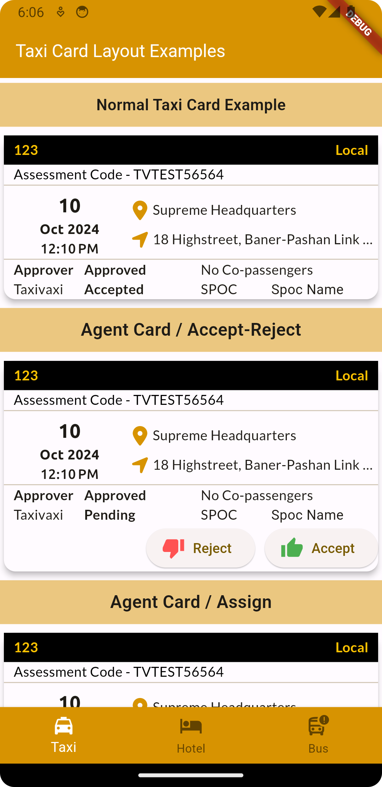
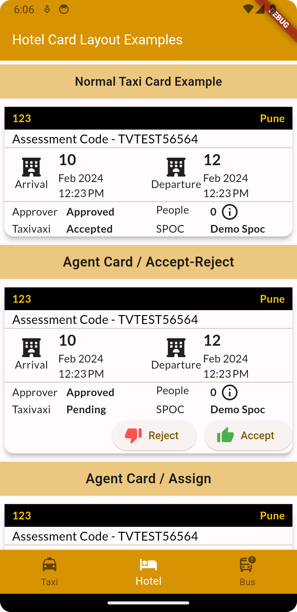
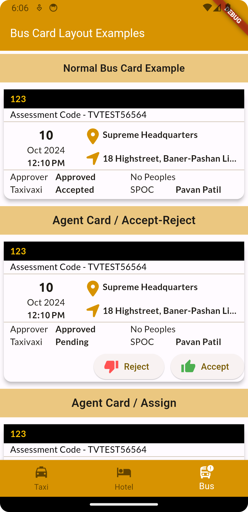

This package is useful for taxi,bus,hotel,train and flight bookings

## Features

Currently Under Development,This package is designed by BAI infosolutions private limited and for taxivaxi. 
Re-Use of this package is allowed but customization is not allowed by third party user.

## Getting started

Add  booking_card_layout: <latest_version> in pubspec.yaml

Import booking_card_layout/taxi_card_layout.dart


## Usage

              TaxiCardLayout(
                context: context,
                referenceNo: '123',
                tourType: 'Local',
                assessmentCode: 'xxxx',
                pickupDatetime: '2024-10-10 12:10:00',
                pickupLocation: 'Supreme Headquarters',
                dropLocation: '18 Highstreet, Baner-Pashan Link Road',
                statusCompany: 'Approved',
                passengerList: [],
                statusTv: 'Accepted',
                onAssignTap: (){
                    ScaffoldMessenger.of(context).showSnackBar(const SnackBar(content: Text("Clicked On Assign")));
                },
                onAcceptTap: (){
                    ScaffoldMessenger.of(context).showSnackBar(const SnackBar(content: Text("Clicked On Accept")));
                },
                onRejectTap: (){
                    ScaffoldMessenger.of(context).showSnackBar(const SnackBar(content: Text("Clicked On Reject")));
                }).normal(),


## Additional information

This package is managed by BAI infosolutions, All rights regarding editing and updating the package is reserved by BAI Infosolutions.

## Screenshots





```dart
import 'package:booking_card_layout/taxi_card_layout.dart';
import 'package:booking_card_layout/tv_theme.dart';
import 'package:flutter/material.dart';
class TaxiCardLayouts extends StatefulWidget {
  const TaxiCardLayouts({super.key});

  @override
  State<TaxiCardLayouts> createState() => _TaxiCardLayoutsState();
}

class _TaxiCardLayoutsState extends State<TaxiCardLayouts> {
  @override
  Widget build(BuildContext context) {
    return  Scaffold(
      appBar: AppBar(title: const Text("Taxi Card Layout Examples",style: TextStyle(color: Colors.white,fontSize: 18),),backgroundColor: TVTheme.secondColor,),
      body: ListView(
        children: [
          Container(
            margin: const EdgeInsets.only(top: 5,bottom: 5),
            color: TVTheme.secondColor.withOpacity(0.5),
            alignment: Alignment.center,
            height: 45,
            child: const Text(
              "Normal Taxi Card Example",
              style: TextStyle(
                  fontWeight: FontWeight.w600,
                  fontSize: 16
              ),
            ),
          ),
          TaxiCardLayout(
              context: context,
              referenceNo: '123',
              tourType: 'Local',
              assessmentCode: 'TVTEST56564',
              pickupDatetime: '2024-10-10 12:10:00',
              pickupLocation: 'Supreme Headquarters',
              dropLocation: '18 Highstreet, Baner-Pashan Link Road',
              statusCompany: 'Approved',
              passengerList: [],
              statusTv: 'Accepted',
              onAssignTap: (){
                ScaffoldMessenger.of(context).showSnackBar(const SnackBar(content: Text("Clicked On Assign")));
              },
              onAcceptTap: (){
                ScaffoldMessenger.of(context).showSnackBar(const SnackBar(content: Text("Clicked On Accept")));
              },
              onRejectTap: (){
                ScaffoldMessenger.of(context).showSnackBar(const SnackBar(content: Text("Clicked On Reject")));
              }).normal(),
          Container(
            margin: const EdgeInsets.only(top: 5,bottom: 5),
            color: TVTheme.secondColor.withOpacity(0.5),
            alignment: Alignment.center,
            height: 45,
            child: const Text(
              "Agent Card / Accept-Reject",
              style: TextStyle(
                  fontWeight: FontWeight.w600,
                  fontSize: 18
              ),
            ),
          ),
          TaxiCardLayout(
              context: context,
              referenceNo: '123',
              tourType: 'Local',
              assessmentCode: 'TVTEST56564',
              pickupDatetime: '2024-10-10 12:10:00',
              pickupLocation: 'Supreme Headquarters',
              dropLocation: '18 Highstreet, Baner-Pashan Link Road',
              statusCompany: 'Approved',
              passengerList: [],
              statusTv: 'Pending',
              onAssignTap: (){
                ScaffoldMessenger.of(context).showSnackBar(const SnackBar(content: Text("Clicked On Assign")));
              },
              onAcceptTap: (){
                ScaffoldMessenger.of(context).showSnackBar(const SnackBar(content: Text("Clicked On Accept")));
              },
              onRejectTap: (){
                ScaffoldMessenger.of(context).showSnackBar(const SnackBar(content: Text("Clicked On Reject")));
              }).agentNew(),
          Container(
            margin: const EdgeInsets.only(top: 5,bottom: 5),
            color: TVTheme.secondColor.withOpacity(0.5),
            alignment: Alignment.center,
            height: 45,
            child:  const Text(
              "Agent Card / Assign",
              style: TextStyle(
                  fontWeight: FontWeight.w600,
                  fontSize: 18
              ),
            ),
          ),
          TaxiCardLayout(
              context: context,
              referenceNo: '123',
              tourType: 'Local',
              assessmentCode: 'TVTEST56564',
              pickupDatetime: '2024-10-10 12:10:00',
              pickupLocation: 'Supreme Headquarters',
              dropLocation: '18 Highstreet, Baner-Pashan Link Road',
              statusCompany: 'Approved',
              passengerList: [],
              statusTv: 'Accepted',
              onAssignTap: (){
                ScaffoldMessenger.of(context).showSnackBar(const SnackBar(content: Text("Clicked On Assign")));
              },
              onAcceptTap: (){
                ScaffoldMessenger.of(context).showSnackBar(const SnackBar(content: Text("Clicked On Accept")));
              },
              onRejectTap: (){
                ScaffoldMessenger.of(context).showSnackBar(const SnackBar(content: Text("Clicked On Reject")));
              }).agentNew(),
          Container(
            margin: const EdgeInsets.only(top: 5,bottom: 5),
            color: TVTheme.secondColor.withOpacity(0.5),
            alignment: Alignment.center,
            height: 45,
            child: const Text(
              "Approver Card / Approve-Reject",
              style: TextStyle(
                  fontWeight: FontWeight.w600,
                  fontSize: 18
              ),
            ),
          ),
          TaxiCardLayout(
              context: context,
              referenceNo: '123',
              tourType: 'Local',
              assessmentCode: 'TVTEST56564',
              pickupDatetime: '2024-10-10 12:10:00',
              pickupLocation: 'Supreme Headquarters',
              dropLocation: '18 Highstreet, Baner-Pashan Link Road',
              statusCompany: 'Approved',
              passengerList: [],
              statusTv: 'Accepted',
              onApproveTap: (){
                ScaffoldMessenger.of(context).showSnackBar(const SnackBar(content: Text("Clicked On Approve")));
              },
              onRejectTap: (){
                ScaffoldMessenger.of(context).showSnackBar(const SnackBar(content: Text("Clicked On Reject")));
              }).approverNew(),
        ],
      ),
    );
  }
}

```